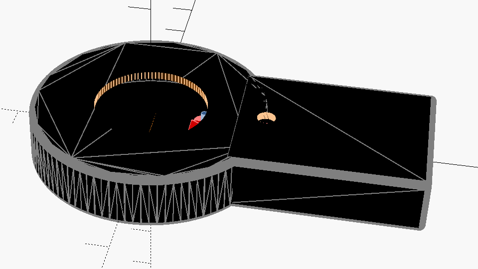

# Tesla Key

> This is a work-in-progress project



## Summary

A physical key-like device for the Tesla Model S, with a built-in e-paper display.


## Components

This project consists of several components, the folder structure is organized as follows:

```
hardware
│   The 3D-printable components, such as the case and buttons for the key
software
└───app
|   |   The iPhone app that acts as a gateway between the unoffical Tesla API and the "Tesla key" device
└───key
    |   The firmware for the "Tesla Key" device
```
